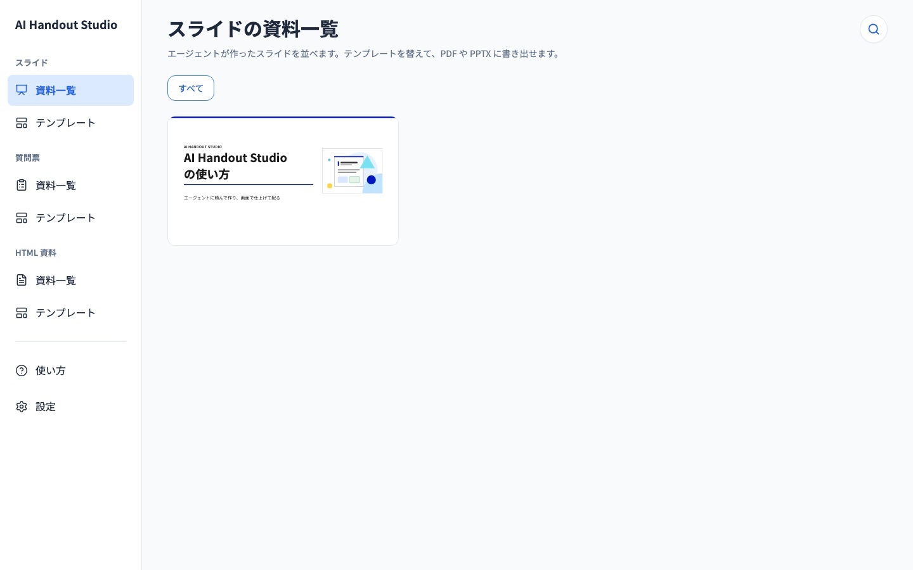
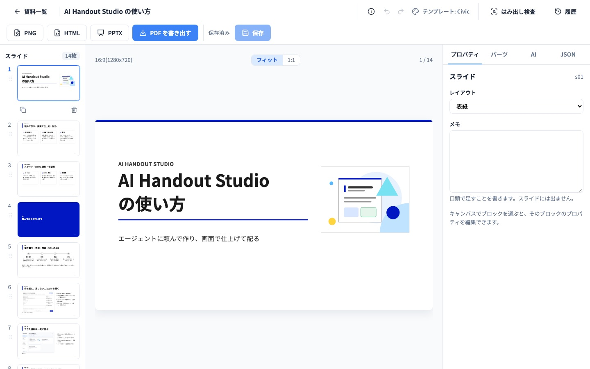
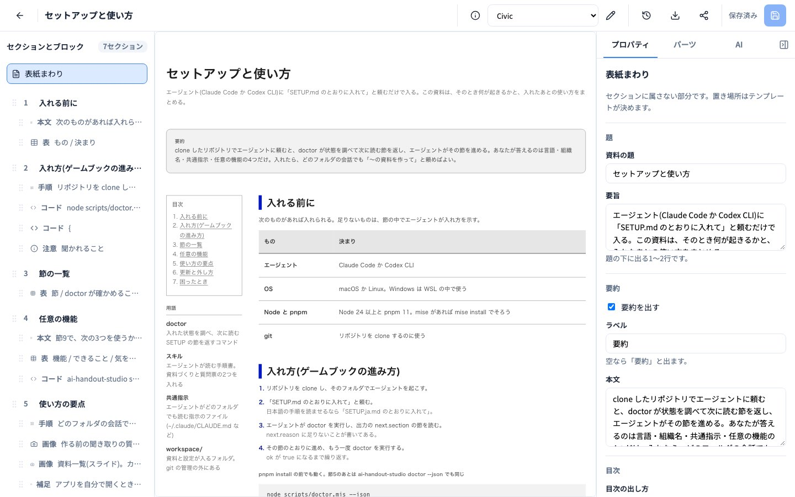
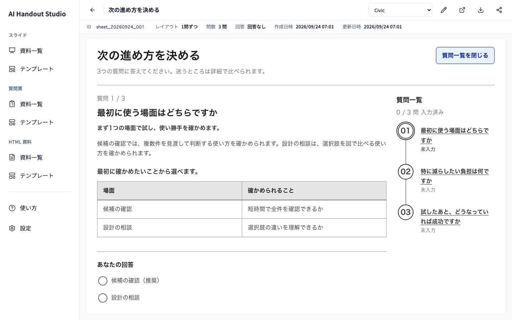

# AI Handout Studio

[English](README.md) | 日本語

コーディングエージェントとの会話を、そのまま資料にする道具。作ってと頼むと、足りないことがあれば短い質問票で聞かれ、そのあと中身が JSON で書かれる。できたものはブラウザで読み、直し、書き出す。

資料は3区分。

- **スライド** — 1280x720 のデッキ。PDF・PNG・PowerPoint(登壇用は発表者ノート付き)に書き出せる
- **HTML 資料** — 節・表・図・画像を持つ報告書や仕様書。1枚の HTML に書き出せる(PDF はブラウザーの印刷で作る)
- **質問票** — 書き始める前にエージェントが聞く短い質問の並び。画面で答え、会話へ回答を貼り戻す

見た目はテンプレート(標準で10種類以上)が決め、できた資料は検索・お気に入り・同じ Wi-Fi のスマホからも開ける一覧に並ぶ。

| | |
|---|---|
|  |  |
|  |  |

## 要るもの

- macOS か Linux。Windows は WSL の中で動かす
- Node 24 以上、pnpm 11(入れ方は [SETUP.ja.md](SETUP.ja.md))
- Claude Code か Codex CLI。エージェントに資料作りと下の入れ方を頼む

## 入れ方

次の3つのどれかで始める。

1. **Claude Code:** リポジトリを clone し、そのフォルダで Claude Code を起動して `/studio-setup` と打つ
2. **Codex CLI:** clone したリポジトリを開き、「SETUP.md のとおりに入れて」と頼む
3. **clone の前なら:** エージェントに「https://github.com/GentaAmeku/ai-handout-studio を clone して、SETUP.md のとおりに入れて」と頼む

セットアップはゲームブックの形で進む。エージェントが `doctor` を実行し、指された節を読み、済むまで繰り返す。聞かれるのは言語・組織名・いくつかの任意の機能だけ([SETUP.ja.md](SETUP.ja.md)。英語の手順は [SETUP.md](SETUP.md))。手で入れたい人も、同じファイルにコマンドが全部ある。

入り終えたら、どのフォルダの会話でも「〜の資料を作って」と頼める。

## コマンド

```
ai-handout-studio new --title <題名> [--outline <構成>] [--template <名前>]
ai-handout-studio check <ファイル> [--minutes <分>]
ai-handout-studio open [<id>] [--lan|--no-lan]
ai-handout-studio restart [<id>] [--lan|--no-lan]
ai-handout-studio templates [--kind slide|sheet|document]
ai-handout-studio sheet new --questions <ファイル> [--title <題名>] [--template <名前>]
ai-handout-studio document new --json <ファイル> [--title <題名>] [--template <名前>]
ai-handout-studio share <id> [--url <URL>]
ai-handout-studio shot <URL か HTML のファイル> --out <PNG>
ai-handout-studio diagram <architecture|workflow|sequence|dataflow|lifecycle> <spec.json> --out <PNG か JPG か WebP>
ai-handout-studio examples [--lang ja|en]
ai-handout-studio settings [--set <キー>=<値>]
ai-handout-studio doctor [--json]
```

引数なしで `ai-handout-studio` を実行すると全部の一覧が出る。ふだんはエージェントの `ai-handout-studio` スキルを通して使い、これらのコマンドはその内部で呼ばれる。

## 今の制限

- 意匠テンプレートに同梱の見本の中身(`design/templates/slide/*/sample.json`)は、選んだ言語によらず日本語で書いてある。テンプレートを選ぶときの見本だけの話で、実際に作る資料は設定した言語になる
- 画面の文言と作った資料は日本語・英語に対応する(`settings --set locale=en`)

## ライセンス

[MIT](LICENSE)。「Civic」テンプレートの出典と同梱の書体のライセンスは [NOTICE](NOTICE) にある。
