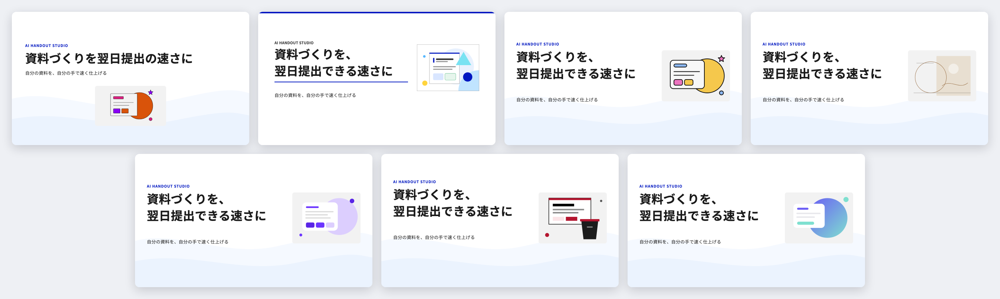
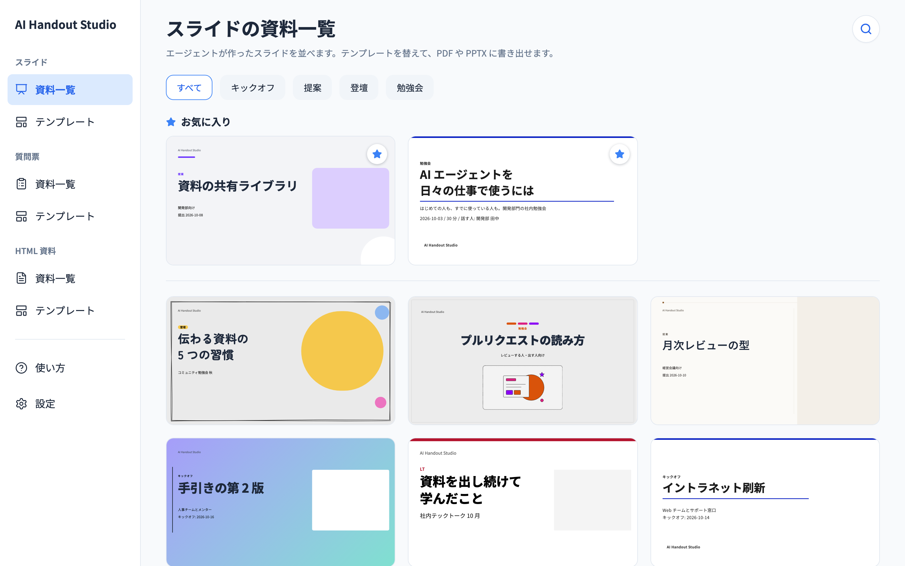
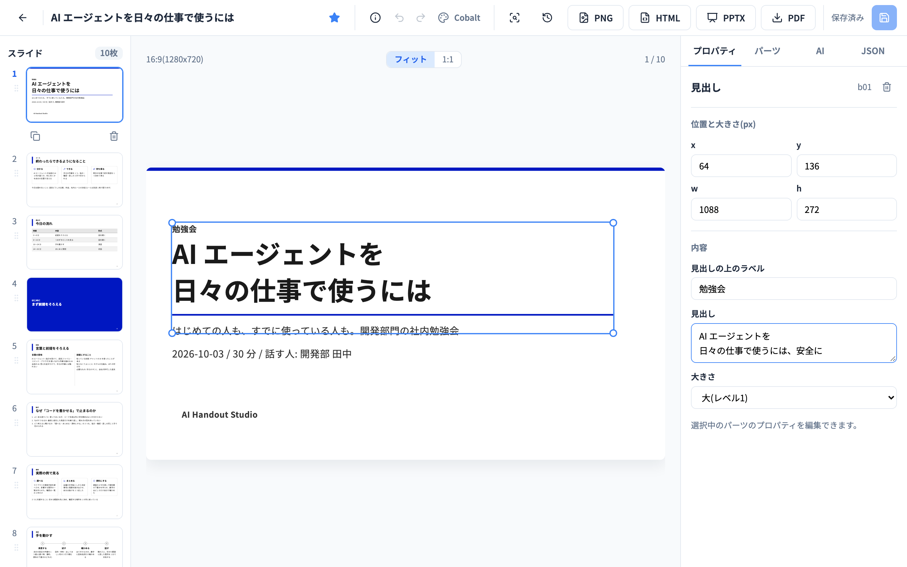
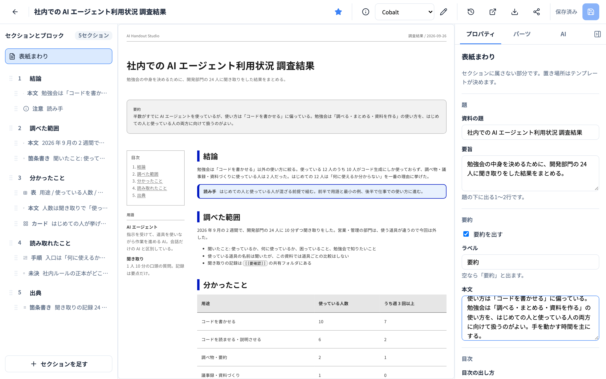
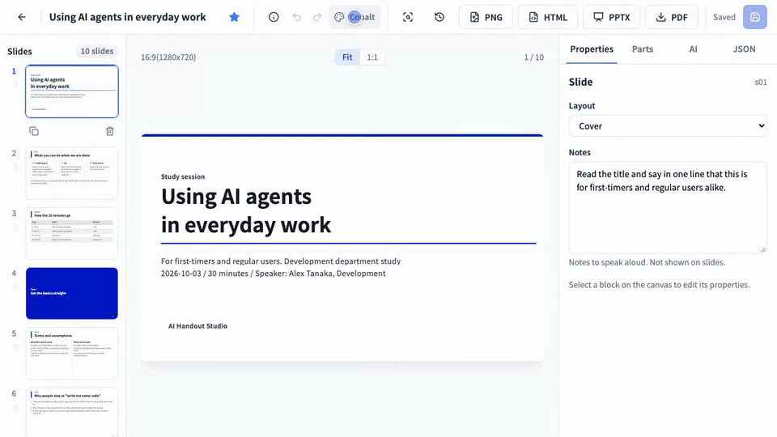
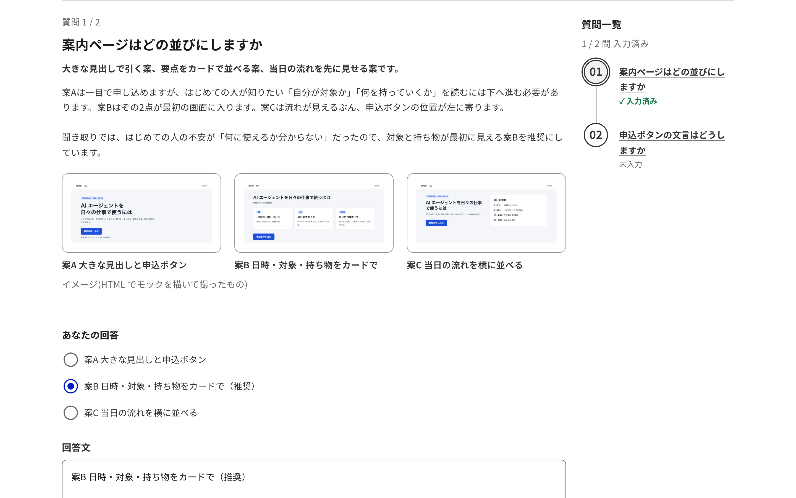
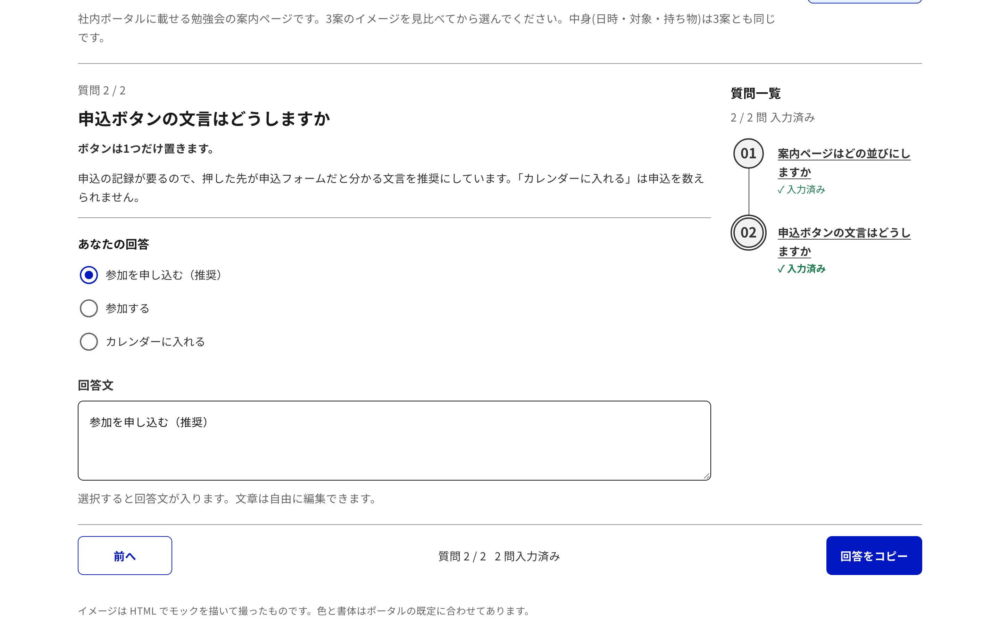
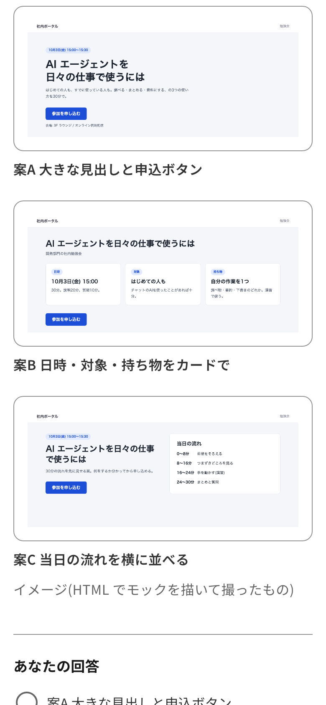
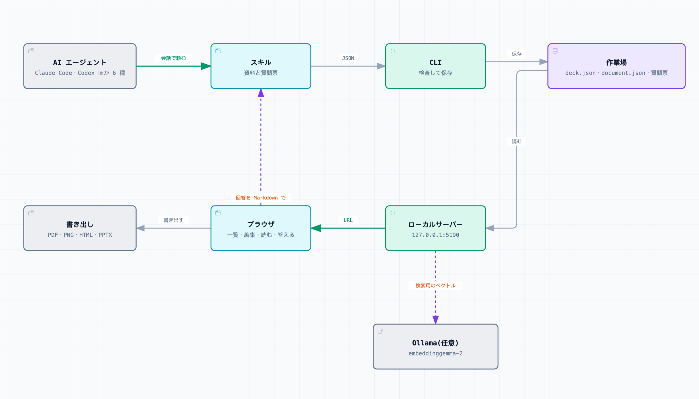

# AI Handout Studio

Claude Code や Codex との会話を、スライド(1280x720 のデッキ)・HTML 資料・質問票にする。テンプレートを切り替え、画面で直し、PDF・PNG・HTML・PPTX に書き出す。

[](https://github.com/GentaAmeku/ai-handout-studio/actions/workflows/ci.yml)
[](LICENSE)
[](#入れ方)

[English](README.md) | 日本語

エージェントはもうスライドも報告書も書ける。ただ、できたものは会話を始めたフォルダのどこかにあるファイルで、1行直すにもまた頼み、次に作ったものは前と見た目が違う。AI Handout Studio は、Claude Code や Codex で毎週のように資料を作る人のためのアプリ。作った資料は手元の1つの一覧に並び、画面で直し、見た目はワンクリックで替え、PDF・PPTX・HTML で渡せる。



*同じ表紙、7 つのテンプレート。頼むときに名前で指定しても、あとで画面で替えてもよい。*

<!-- 172: デモ動画ができたら、user-attachments の URL をこの位置に 1 行で置く -->

## 2 行で始める

```bash
git clone https://github.com/GentaAmeku/ai-handout-studio.git && cd ai-handout-studio
claude   # 起動したら /studio-setup と打つ(Codex CLI は codex を起動して $studio-setup)
```

ほかのエージェント(OpenCode・Gemini CLI・Cursor CLI・Grok CLI)なら、これを貼る: *「https://github.com/GentaAmeku/ai-handout-studio を clone して、SETUP.md のとおりに入れて」*

セットアップはゲームブックの形で進む。最初にチェックリストが出て、エージェントが `doctor` を実行し、指された節を読み、済むまで繰り返す。聞かれるのは言語・組織名・いくつかの任意の機能だけ。終わったら、どのフォルダの会話でも *「〜のスライドを作って」* と頼める。

## できること

### 頼むと、一覧に並ぶ



どのフォルダの会話から頼んでも、できた資料は 1 つの一覧に並ぶ。検索・お気に入り・タグがあり、前に作った資料の隣に収まる。

### 画面で直す



キャンバスの文字をダブルクリックして直し、ブロックを動かして大きさを変え、スライドを並べ替え、はみ出しを検査し、保存ごとの履歴(直近 30 版)に戻れる。大きな直しは会話に戻して頼む(*「3 枚目を短くして」*)。編集画面が書く `request.md` をエージェントが読み、返ってきた `patch.json` を画面で取り込む。編集画面の AI パネルからエージェントを起動する機能は試作(experimental)。



HTML 資料は 3 列(構成・ページ・プロパティ)で開く。文を直し、セクションをドラッグで並べ替え、保存した版と変更前 / 変更後で見比べ、1 枚の HTML に書き出すか、共有の依頼をコピーして Claude Code に Artifact として公開してもらう。

### テンプレート 15 種、ワンクリックで切り替え



*[デモ動画](video/README.md)の 5 秒。同じ資料を 4 つの見た目で。*

スライドの見た目 8 種と構成 5 種(提案・勉強会・自己紹介・キックオフ・登壇)、質問票 3 種、HTML 資料 4 種。頼むときに名前で指定しても(*「Lumen で作って」*)、あとで替えてもよく、中身はそのまま。テンプレートは `tokens.json` から CSS を生むので、自分の見た目も足せる([design/templates/README.md](design/templates/README.md))。

### 会話の往復の代わりに質問票



書き始める前に、エージェントは聞きたいことを 1 枚にまとめて聞く。読み手は誰か、長さは、3 つの構成のどれか、このモックのどれか。質問ごとに、決めるのに要る比較表・画像・図と、推奨の答えが付く。



最後の質問で「回答をコピー」を押し、Markdown を会話に貼る。エージェントはそれを読んで続きを進め、回答を質問票に残す。

### 渡す

スライドは PDF・PNG・HTML・PPTX に書き出せる。文字は文字のままで、ノートは発表者ノートになる。HTML 資料と質問票は 1 枚の HTML に書き出せるほか、Claude の Artifact として URL で公開でき、同じ Wi-Fi のスマホからも読める。



Claude Code では、同梱の mod が入力欄の上に帯を出す。*この会話の資料 3件* の文字と、読む・直す・答えるへのリンクが並ぶ。

## 仕組み



エージェントはスライドを描かない。同梱のスキルで JSON(`deck.json`・`document.json`・質問の JSON)だけを書き、テンプレートがデザイントークンから CSS を生む。だから中身はエージェントが、見た目はテンプレートが決める。ローカルサーバーがその JSON をブラウザに描き(一覧・編集・読む画面)、書き出しもすべて同じ描画から作る。PPTX は実測した位置から図形と文字に組み直したもので、スクリーンショットではない。結果を信用できるものにしているのは次の 3 つ。エージェントは `check` が通るまで直し、編集画面は枠からはみ出した文字を指す。出どころの無い数値・日付・固有名詞はでっち上げず `[[要確認]]` のまま残す。HTML 資料は、文脈を持たない読み手に読ませる読者テストを通してから渡す。

## 何が違うか

エージェントには、PPTX や DOCX を書くスキルや、スライドを見せる Artifact がたぶんもう付いている。それに比べて増えるのは次の 3 つ。

- **消えない一覧。** どの会話で作った資料も 1 か所に並び、検索・お気に入り・タグで引ける。たまたま開いていたフォルダのファイルにならない。
- **画面で直せる。** 文言の修正、ブロックの移動、テンプレートの切り替え、はみ出し検査を、もう一度頼まずに済ませる。大きな直しは会話に戻せる。
- **比較表つきの質問票と、Markdown で戻る回答。** エージェントが決めてほしいことが、決めるための材料と一緒に 1 枚にまとまり、資料として残る。

エージェントに JSON を書かせてアプリが描く道具はほかにもある。この道具はスライドの生成だけでなく、その前の質問、あとの一覧と編集、そしてスライドと並ぶ HTML 資料と質問票まで、やり取り全体を扱う。

## 手元で何が動くか

- 自分の PC で動く。ホストされたサービスもアカウントも無く、任意の機能をオンにしない限り外へは何も送らない。`share` は質問票・HTML 資料を Claude の Artifact として公開し、`lan` は同じ Wi-Fi の端末に読ませ、`imageGeneration` は手元にある画像生成の CLI を呼ぶ。
- 資料は clone の中の `workspace/` に置かれる。
- clone の外に書くのはリンクだけ。コマンドを `~/.local/bin` に、2 つのスキルを `~/.agents/skills` か `~/.claude/skills` に、mod を `~/.claude/skills` に置く。ほかには、エージェントの共通指示に `ai-handout-studio` の段落を 1 つ、`~/.local/bin` が `PATH` に無ければシェルの設定に 1 行。この 2 つは同意を取ってから書く。
- LAN モードでも、ほかの端末からの要求は読むだけ。保存・削除・エージェントの起動はこの PC からしかできない。詳しくは [SECURITY.md](SECURITY.md)。

## 入れ方

要るのは macOS か Linux(Windows は WSL)、Node 24 以上、pnpm 11、そして Claude Code・Codex CLI・OpenCode・Gemini CLI・Cursor CLI・Grok CLI のどれか(Node と pnpm の入れ方は [SETUP.ja.md](SETUP.ja.md))。

1. **Claude Code:** リポジトリを clone し、そのフォルダで Claude Code を起動して `/studio-setup` と打つ
2. **Codex CLI:** clone したリポジトリを開き、`$studio-setup` と打つ
3. **そのほかのエージェント**や clone の前なら: *「https://github.com/GentaAmeku/ai-handout-studio を clone して、SETUP.md のとおりに入れて」* と頼む(clone 済みなら *「SETUP.md のとおりに入れて」*)

手で入れたい人は [SETUP.ja.md](SETUP.ja.md)(英語は [SETUP.md](SETUP.md))にコマンドが全部ある。更新(`git pull`)のあとにもう一度流してよい。済んだ節は済んだままで、新しい版で増えたものだけを聞かれる。

**外し方:** clone したフォルダで `/studio-uninstall`(Claude Code)か `$studio-uninstall`(Codex CLI)と打つか、*「UNINSTALL.md のとおりに外して」* と頼む。
聞かれるのは始める前の 1 回だけで、資料と clone を残すかもそこで決める([UNINSTALL.ja.md](UNINSTALL.ja.md))。

<details>
<summary>コマンド</summary>

ふだんはエージェントの `ai-handout-studio` スキルと `question-sheet` スキルを通して使い、これらはその内部で呼ばれる。引数なしで `ai-handout-studio` を実行すると同じ一覧が出る。

```
ai-handout-studio new --title <題名> [--outline <構成>] [--template <テンプレート>]
ai-handout-studio check <ファイル> [--minutes <分>] [--run]
ai-handout-studio open [<id>] [--lan|--no-lan]
ai-handout-studio restart [<id>] [--lan|--no-lan]
ai-handout-studio templates [--kind slide|sheet|document]
ai-handout-studio sheet new --questions <質問JSON> [--title <題名>] [--template <テンプレート>] [--layout <focus|overview|all|print>]
ai-handout-studio sheet update <id> --questions <質問JSON> [--layout <focus|overview|all|print>]
ai-handout-studio sheet update <id> --layout <focus|overview|all|print>
ai-handout-studio sheet answers <id> --answers <回答JSON>
ai-handout-studio sheet export <id> [--out <書き出し先>]
ai-handout-studio document new --json <document.json> [--title <題名>] [--template <テンプレート>]
ai-handout-studio document update <id> --json <document.json> [--title <題名>]
ai-handout-studio document export <id> [--out <書き出し先>] [--text]
ai-handout-studio share <id>
ai-handout-studio share <id> --url <公開した Artifact の URL>
ai-handout-studio shot <URL か HTML のファイル> --out <PNG> [--width 1440] [--height 900] [--full] [--wait <ミリ秒>]
ai-handout-studio diagram <architecture|workflow|sequence|dataflow|lifecycle> <spec.json> --out <画像(.png・.jpg・.webp)>
ai-handout-studio design build
ai-handout-studio settings
ai-handout-studio settings --set <キー>=<値> [--set <キー>=<値> ...]
  キー: orgName・locale(ja|en)・features.lan・features.imageGeneration・features.share(true|false)・agentInstructions・archify・mods.claude(ask|declined)
ai-handout-studio examples [--lang ja|en]
ai-handout-studio doctor [--uninstall] [--json|--checklist]
```

</details>

## 今の制限

- 画面の文言・テンプレートの見本・作った資料は日本語と英語に対応する(`settings --set locale=en`)。スキルの本文と CLI のメッセージは日本語。
- HTML 資料と質問票の見本に載せた画像(画面のスクリーンショットと設計図)は、英語の見本でも日本語の画面のまま。
- URL での共有とスマホ用の原寸ページがあるのは質問票と HTML 資料で、スライドにはまだ無い。共有には Claude Code が要る。
- Claude Code の mod は Claude Code 2.1.287 以降で動く。

## もっと読む

- 入れる前に、この道具で作った使い方のスライドを読める: [examples/ja/usage.pdf](examples/ja/usage.pdf)([英語](examples/en/usage.pdf))
- テンプレートの仕組みと足し方: [design/templates/README.md](design/templates/README.md)
<!-- 171: 記事(Zenn の日本語記事・英語記事)が公開されたら、ここにリンクを足す -->

作者は毎日 Claude Code で資料を作っていて、それを 1 か所に集め、手で直し、選んだ見た目で渡したくてこれを作った。続きは[ブログ](https://www.genta-ameku.com)に。

Issue と提案は歓迎([CONTRIBUTING.md](CONTRIBUTING.md))。脆弱性は [SECURITY.md](SECURITY.md) のとおり非公開で報告してほしい。

## ライセンス

[MIT](LICENSE)。「Cobalt」テンプレートの出典と同梱の書体のライセンスは [NOTICE](NOTICE) にある。

プロンプトの往復が 1 回減ったら、Star を 1 つ。ほかの人が見つけやすくなる。
