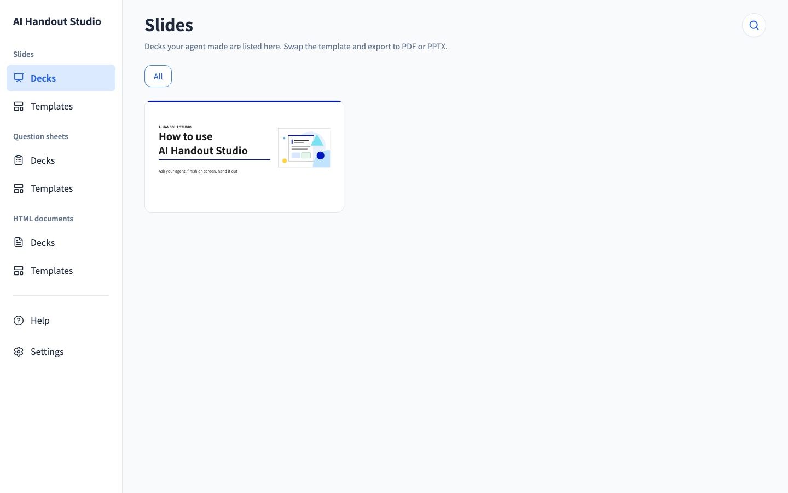
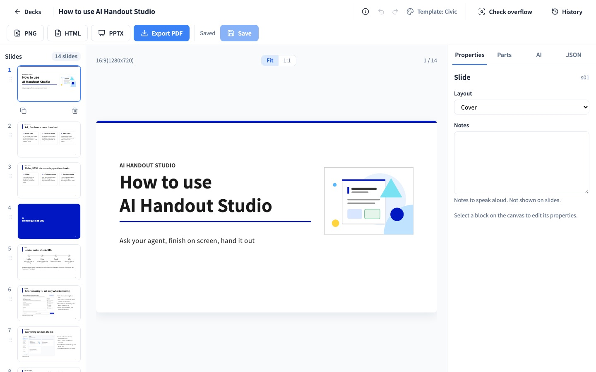
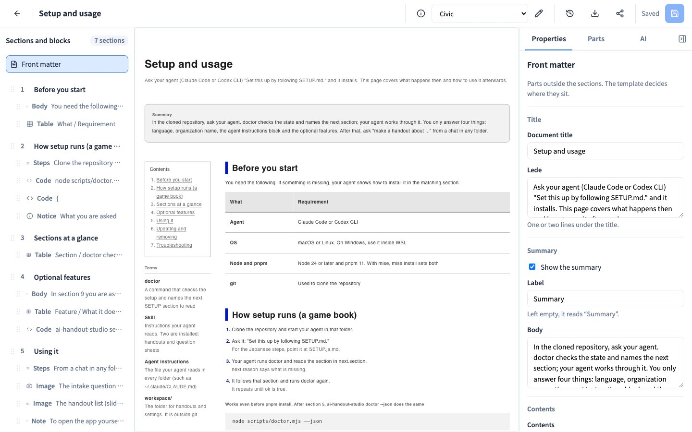
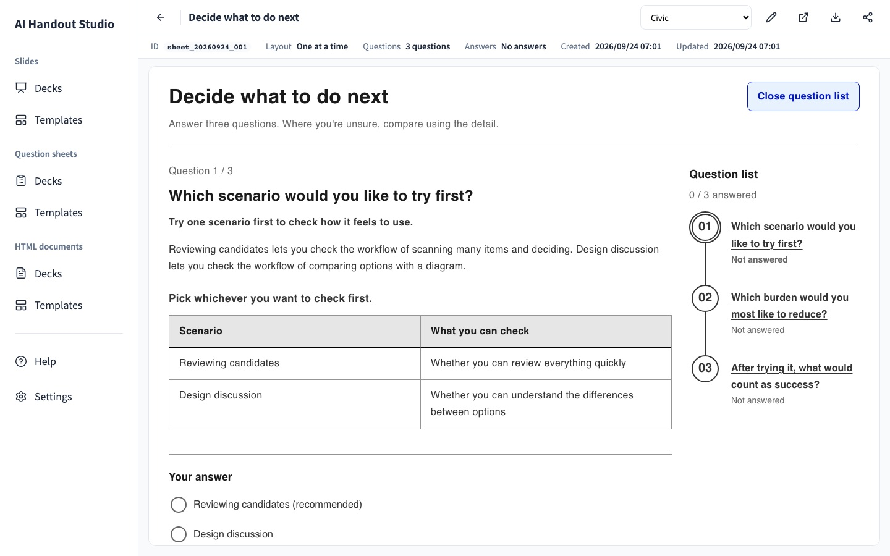

# AI Handout Studio

English | [日本語](README.ja.md)

A local app that keeps the handouts your AI agent makes — slides, HTML
documents and question sheets — in one place, where you read, edit and
export them in the browser. The agent writes them with the bundled skills.
When it needs something from you, it asks through a bundled question sheet:
one page with suggested answers and comparison tables, lighter to think
through than a back-and-forth in chat.

Three kinds of handout, one app:

- **Slides** — a 1280x720 deck, exported to PDF, PNG or PowerPoint (with
  speaker notes for a talk).
- **HTML documents** — a report, spec or write-up with sections, tables,
  figures and images, exported to a single HTML file (print it from the
  browser for a PDF).
- **Question sheets** — a short set of questions your agent asks you before
  it starts writing, so it doesn't have to guess. You answer on screen and
  copy the answers back into the conversation.

Everything is styled by a template (10+ built in) and lands in a handout
list you can search, favorite, and open from your phone on the same Wi-Fi.

| | |
|---|---|
|  |  |
|  |  |

## Requirements

- macOS or Linux. On Windows, run everything inside WSL.
- Node 24 or later, pnpm 11 (see [SETUP.md](SETUP.md) for how to install
  them).
- Claude Code or Codex CLI, so your agent can write handouts for you and
  follow the setup steps below.

## Install

Start in one of three ways:

1. **Claude Code:** clone the repository, start Claude Code in that folder,
   and type `/studio-setup`.
2. **Codex CLI:** clone the repository, open it, and ask: "Set this up by
   following SETUP.md."
3. **Before cloning:** ask your agent: "Clone
   https://github.com/GentaAmeku/ai-handout-studio and set it up by following
   SETUP.md."

The setup is a game book: your agent runs `doctor`, reads the section it
points to, and repeats until everything checks out. It asks you only about
language, your organization's name, and a few optional features — see
[SETUP.md](SETUP.md) (or [SETUP.ja.md](SETUP.ja.md) for the Japanese steps).
Prefer to install by hand instead? The same file has every command.

Once it's done, ask your agent in any folder: "make a handout about ...".

## Uninstall

In the cloned folder, type `/studio-uninstall` in Claude Code, or ask Codex
CLI: "Uninstall this by following UNINSTALL.md." It is a game book like the
setup: your agent runs `doctor --uninstall` and removes what is left in order
(the server, the `ai-handout-studio` block in your agent instructions, the
skill and command links, and Playwright's Chromium). It asks you once, before
it starts, including whether to keep or delete your handouts (`workspace/`)
and the clone — see [UNINSTALL.md](UNINSTALL.md).

## Commands

```
ai-handout-studio new --title <title> [--outline <outline>] [--template <name>]
ai-handout-studio check <file> [--minutes <n>]
ai-handout-studio open [<id>] [--lan|--no-lan]
ai-handout-studio restart [<id>] [--lan|--no-lan]
ai-handout-studio templates [--kind slide|sheet|document]
ai-handout-studio sheet new --questions <file> [--title <title>] [--template <name>]
ai-handout-studio document new --json <file> [--title <title>] [--template <name>]
ai-handout-studio share <id> [--url <url>]
ai-handout-studio shot <url or html file> --out <png>
ai-handout-studio diagram <architecture|workflow|sequence|dataflow|lifecycle> <spec.json> --out <png|jpg|webp>
ai-handout-studio examples [--lang ja|en]
ai-handout-studio settings [--set <key>=<value>]
ai-handout-studio doctor [--uninstall] [--json]
```

Run `ai-handout-studio` with no arguments for the full list. Everyday work
happens through your agent's `ai-handout-studio` skill; these commands are
what it runs under the hood.

## Known limits

- The design system's built-in sample content (in `design/templates/slide/*/sample.json`)
  is written in Japanese, regardless of your chosen language. It only
  affects the preview shown while picking a template — handouts you create
  use the language you set.
- Screen text and generated handouts support Japanese and English
  (`settings --set locale=en`).

## License

[MIT](LICENSE). See [NOTICE](NOTICE) for the "Cobalt" template's source and
the bundled fonts' licenses.
