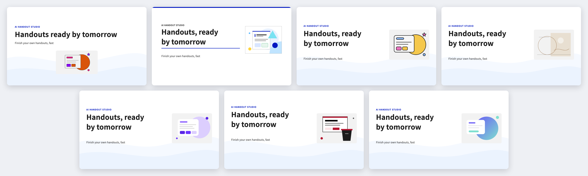
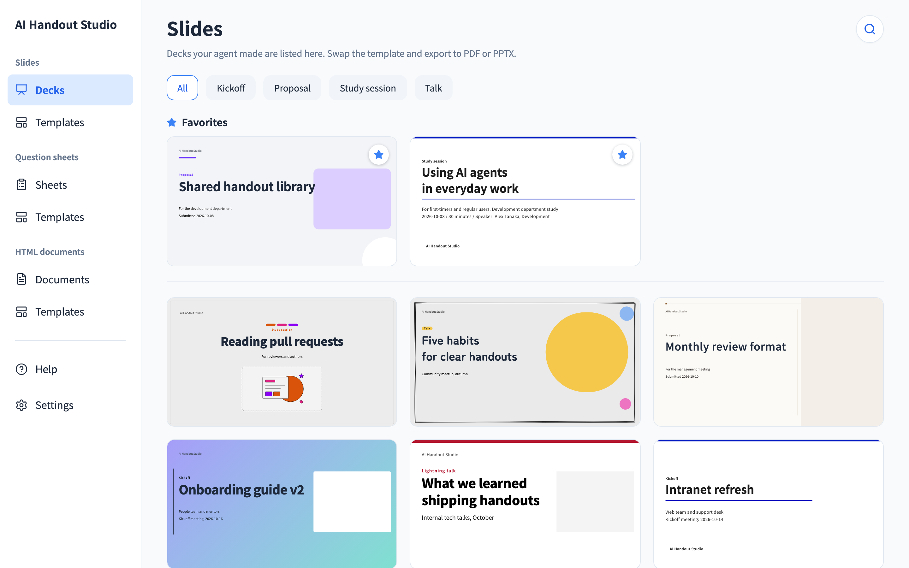
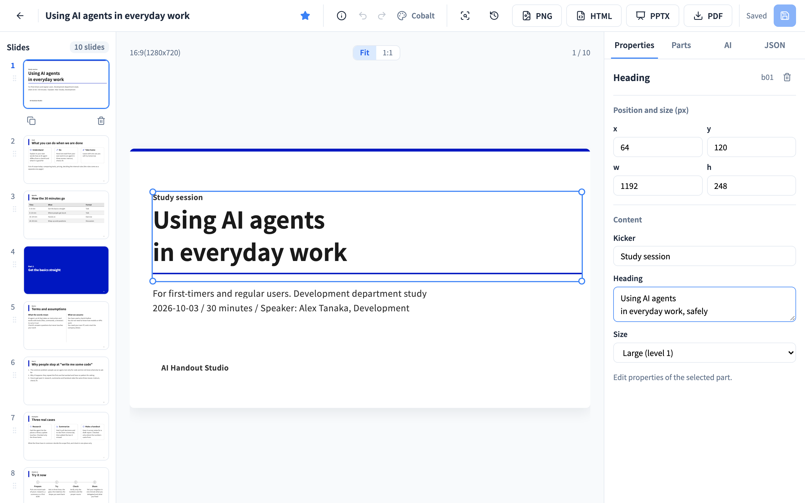
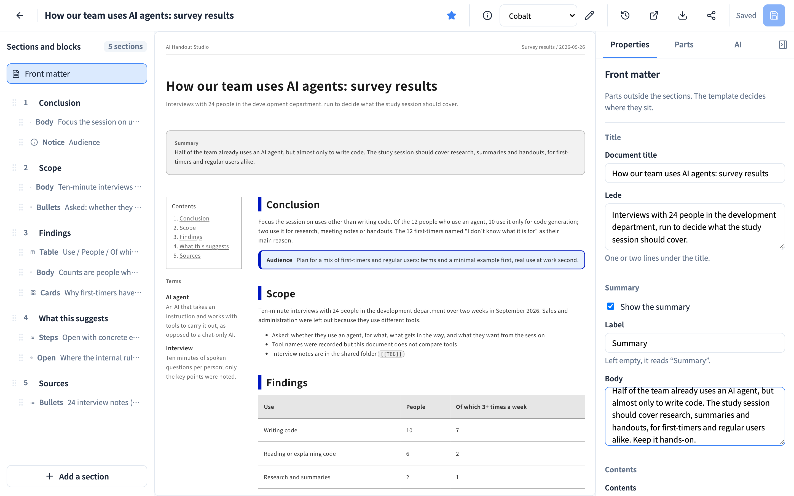
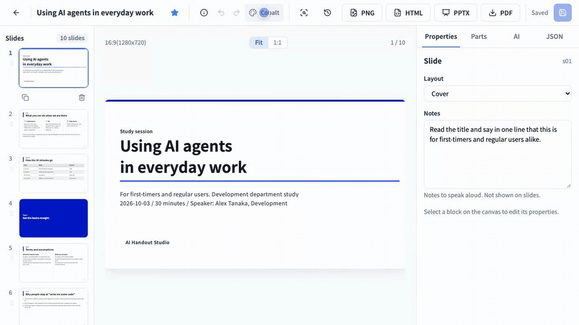
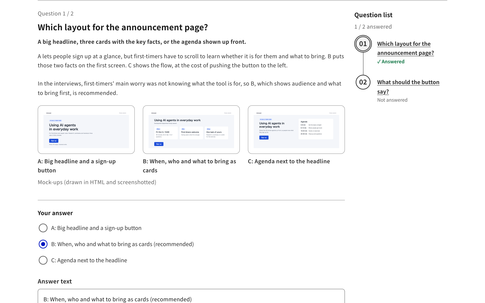
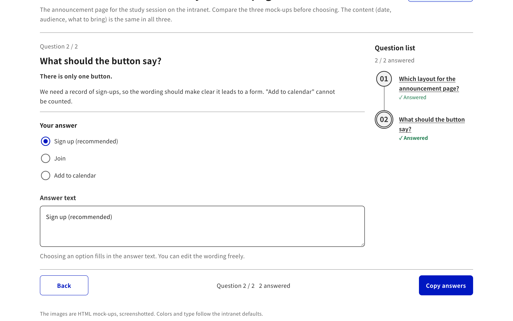
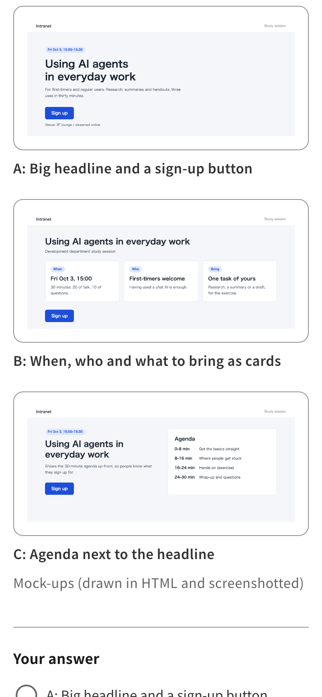
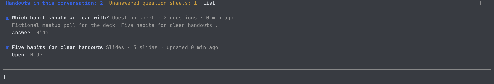
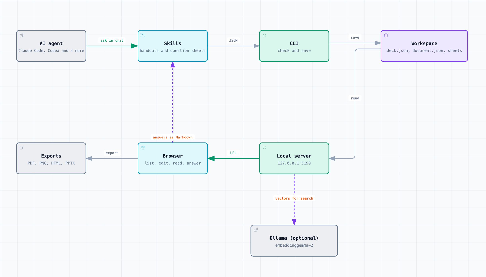

# AI Handout Studio

Turn a conversation with Claude Code or Codex into slides (a 1280x720 deck), HTML documents and question sheets — switch the template, edit on screen, export to PDF, PNG, HTML or PPTX.

[](https://github.com/GentaAmeku/ai-handout-studio/actions/workflows/ci.yml)
[](LICENSE)
[](#install)

English | [日本語](README.ja.md)

Your agent can already write a deck or a report. Then it is a file in whatever folder the conversation ran in, you cannot fix one line without asking again, and the next one looks nothing like the last. AI Handout Studio is for people who make handouts with Claude Code or Codex every week: every handout lands in one local list, you fix it on screen, switch the look in one click, and hand it over as PDF, PPTX or HTML.



*One cover, seven templates. Name one when you ask, or switch on screen later.*

https://github.com/user-attachments/assets/fa47cbb9-e781-4434-936a-7c0807ea56cc

<!-- 172: placed 2026-10-07 — when the demo video exists, paste its user-attachments URL on its own line here. -->

## Start in two lines

```bash
git clone https://github.com/GentaAmeku/ai-handout-studio.git && cd ai-handout-studio
claude   # then type /studio-setup   (Codex CLI: codex, then $studio-setup)
```

Any other agent (OpenCode, Gemini CLI, Cursor CLI, Grok CLI)? Paste this: *"Clone https://github.com/GentaAmeku/ai-handout-studio and set it up by following SETUP.md."*

The setup is a game book: it opens with a checklist, your agent runs `doctor`, reads the section it points to, and repeats until everything checks out. It asks you only about language, your organization's name and a few optional features. When it is done, ask in any folder: *"make slides about ..."*.

## What you get

### Ask, and it lands in the list



Ask from a conversation in any folder; the handout shows up in one list with search, favorites and tags, next to every handout you made before.

Search looks inside handouts too: BM25 full-text search over every section, question and slide, with where it matched and the words around it. With the embedding model embeddinggemma-2 in your local [Ollama](https://ollama.com) (0.40.0 or later), vector search is layered on top (hybrid search, combined by RRF), so handouts worded differently still turn up. `ai-handout-studio search <query> --json` gives an agent the same results, so it can serve as the retriever when an agent builds RAG over your handouts.

### Fix it on screen



Double-click text on the canvas, move and resize blocks, reorder slides, check for overflow, and save with a history of the last 30 versions. Bigger changes go back through the conversation (*"shorten slide 3"*): the agent reads the `request.md` the editor writes and returns a `patch.json` you apply on screen. Launching the agent from the editor's AI panel is experimental.



An HTML document opens in three columns (outline, page, properties): fix the text, drag sections into a new order, compare any saved version as before / after, export it as a single HTML file, or copy a sharing request and let Claude Code publish it as an Artifact.

### 15 templates, switched in one click



*Five seconds from the [demo video](video/README.md): the same deck in four looks.*

8 slide looks plus 5 outlines (proposal, study session, self-introduction, kickoff, talk), 3 question-sheet looks and 4 document looks. Name one when you ask (*"make it with Lumen"*) or switch later; the content stays. A template is a `tokens.json` compiled to CSS, so you can add your own — see [design/templates/README.md](design/templates/README.md).

### Question sheets instead of a chat back-and-forth



Before it writes, the agent asks everything at once on one page: audience, length, which of three layouts, which of these mock-ups. Each question carries the comparison table, image or diagram you need to decide, and a recommended answer.



On the last question, press *Copy answers* and paste the Markdown into the conversation; the agent reads it, carries on, and saves your answers with the sheet.

### Hand it over

Export slides to PDF, PNG, HTML or PPTX — text stays text and the notes become speaker notes — and HTML documents and question sheets to a single HTML file. Question sheets and HTML documents can also be published at a URL as a Claude Artifact and read on a phone on the same Wi-Fi.



In Claude Code, the bundled mod shows a band above the prompt — *Handouts in this conversation: 3* — with links to read, edit or answer each one.



## How it works



The agent never writes a slide. It writes JSON (`deck.json`, `document.json` or a questions file) with the bundled skill, and a template turns design tokens into CSS, so the agent decides content and the template decides the look. A local server renders that JSON in your browser for the list, the editor and the reader, and every export comes from the same rendering: the PPTX is rebuilt from measured positions into shapes and text, not a screenshot. What makes the result something you can trust: the agent runs `check` until it passes and the editor flags text that overflows its box; a number, date or name without a source stays `[[要確認]]` (to confirm) instead of being invented; and an HTML document goes through a reader test — someone without the context reads it — before it is handed over.

## How it differs

Your agent probably already has a skill for PPTX or DOCX files, or an artifact that shows slides. Compared with those, this adds:

- **A list that does not disappear.** Every handout from every conversation is in one place, with search, favorites and tags, instead of a file in the folder you happened to be in.
- **Editing on screen.** Fix wording, move a block, switch the template or check overflow without another round of prompting — and still send bigger changes back through the conversation.
- **Question sheets with comparison tables, and answers that come back as Markdown.** The decisions the agent needs from you are gathered on one page, with the material to decide, and recorded with the handout.

Other tools also let an agent write JSON that an app renders into slides. This one covers the whole exchange around the deck — the questions before, the list and editor after, and HTML documents and question sheets alongside slides — rather than slide generation alone.

## What it touches

- Runs on your machine. No hosted service, no account, and nothing is sent anywhere unless you turn on an optional feature: `share` publishes a sheet or document as a Claude Artifact, `lan` lets devices on your Wi-Fi read, and `imageGeneration` calls an image CLI you already have.
- Your handouts live in `workspace/` inside the clone. Vector search, when you opt in, runs on your local Ollama only and keeps the vectors in `workspace/search/`.
- Outside the clone, setup writes only links — the command in `~/.local/bin`, the two skills in `~/.agents/skills` or `~/.claude/skills`, and the mod in `~/.claude/skills` — plus one `ai-handout-studio` block in your agent's shared instructions, and a `PATH` line in your shell configuration if `~/.local/bin` is not on it. It asks before writing the last two. If you opt into vector search, it also pulls the embedding model (378 MB) into your Ollama; Ollama itself is yours to install.
- In LAN mode, a request from another device can only read; saving, deleting and agent runs stay on this computer. Details in [SECURITY.md](SECURITY.md).

## Install

You need macOS or Linux (WSL on Windows), Node 24 or later, pnpm 11, and one of Claude Code, Codex CLI, OpenCode, Gemini CLI, Cursor CLI or Grok CLI ([SETUP.md](SETUP.md) says how to install Node and pnpm).

1. **Claude Code:** clone the repository, start Claude Code in that folder, and type `/studio-setup`.
2. **Codex CLI:** clone the repository, open it, and type `$studio-setup`.
3. **Any other agent**, or before cloning: ask *"Clone https://github.com/GentaAmeku/ai-handout-studio and set it up by following SETUP.md."* (in the cloned folder: *"Set this up by following SETUP.md."*).

Every command is in [SETUP.md](SETUP.md) ([SETUP.ja.md](SETUP.ja.md) in Japanese) if you prefer to install by hand. Run the setup again after `git pull`: finished sections stay checked, and it asks only about what the new version added.

**Uninstall:** type `/studio-uninstall` (Claude Code) or `$studio-uninstall` (Codex CLI) in the cloned folder, or ask *"Uninstall this by following UNINSTALL.md."*
It asks once, before it starts, whether to keep your handouts and the clone — see [UNINSTALL.md](UNINSTALL.md).

<details>
<summary>Commands</summary>

Everyday work happens through your agent's `ai-handout-studio` and `question-sheet` skills; these are the commands they run. `ai-handout-studio` with no arguments prints the same list.

```
ai-handout-studio new --title <title> [--outline <outline>] [--template <template>]
ai-handout-studio check <file> [--minutes <n>] [--run]
ai-handout-studio open [<id>] [--lan|--no-lan]
ai-handout-studio restart [<id>] [--lan|--no-lan]
ai-handout-studio templates [--kind slide|sheet|document]
ai-handout-studio search <query> [--json]
ai-handout-studio sheet new --questions <questions.json> [--title <title>] [--template <template>] [--layout <focus|overview|all|print>]
ai-handout-studio sheet update <id> --questions <questions.json> [--layout <focus|overview|all|print>]
ai-handout-studio sheet update <id> --layout <focus|overview|all|print>
ai-handout-studio sheet answers <id> --answers <answers.json>
ai-handout-studio sheet export <id> [--out <path>]
ai-handout-studio document new --json <document.json> [--title <title>] [--template <template>]
ai-handout-studio document update <id> --json <document.json> [--title <title>]
ai-handout-studio document export <id> [--out <path>] [--text]
ai-handout-studio share <id>
ai-handout-studio share <id> --url <published Artifact URL>
ai-handout-studio shot <URL or HTML file> --out <PNG> [--width 1440] [--height 900] [--full] [--wait <ms>]
ai-handout-studio diagram <architecture|workflow|sequence|dataflow|lifecycle> <spec.json> --out <image (.png, .jpg, .webp)>
ai-handout-studio design build
ai-handout-studio settings
ai-handout-studio settings --set <key>=<value> [--set <key>=<value> ...]
  keys: orgName, locale (ja|en), features.lan, features.imageGeneration, features.share, features.vectorSearch (true|false), agentInstructions, archify, mods.claude, vectorSearch (ask|declined)
ai-handout-studio examples [--lang ja|en]
ai-handout-studio doctor [--uninstall] [--json|--checklist]
```

</details>

## Known limits

- Screen text, template samples and generated handouts come in Japanese and English (`settings --set locale=en`). The skills' instructions and the CLI's messages are Japanese; agents follow them fine, but you will see Japanese if you read them.
- The images in the HTML document and question sheet samples show the Japanese screens, even in the English samples.
- Sharing at a URL and the full-size phone page exist for question sheets and HTML documents, not yet for slides. Sharing needs Claude Code.
- The Claude Code mod needs Claude Code 2.1.287 or later.

## Read more

- Before installing, read the usage deck this tool made about itself: [examples/en/usage.pdf](examples/en/usage.pdf) ([Japanese](examples/ja/usage.pdf)).
- What a template is and how to add one: [design/templates/README.md](design/templates/README.md).
<!-- 171: add the article links here when they are published — Japanese (Zenn) and English. -->

I built this because I make handouts with Claude Code every day and wanted them in one place, fixed by hand, in a look I chose. More on [my blog](https://www.genta-ameku.com).

Issues and ideas are welcome ([CONTRIBUTING.md](CONTRIBUTING.md)); report a vulnerability privately as [SECURITY.md](SECURITY.md) describes.

## License

[MIT](LICENSE). See [NOTICE](NOTICE) for the "Cobalt" template's source and the bundled fonts' licenses.

If this saves you a round of prompting, a star helps other people find it.
